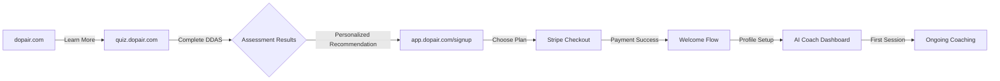

# Premium Onboarding & Payment Flow
## Seamless Journey from Marketing → Assessment → Payment → Platform

---

## 🎯 User Journey Overview



---

## 🔄 Detailed Flow Design

### Phase 1: Discovery & Assessment
```javascript
// User journey starts at marketing site
const journeyStart = {
  entry: "dopair.com/pricing",
  cta: "Take Free Assessment",
  destination: "quiz.dopair.com",
  dataCollected: "none"
};

// DDAS Assessment completion
const assessmentComplete = {
  location: "quiz.dopair.com/results",
  dataCollected: {
    ddasScores: { impulsive: 8, compulsive: 4, total: 12 },
    addictionPathway: "impulsive",
    personalityType: "high_openness",
    anonymousId: "assessment_abc123"
  },
  nextStep: "Personalized plan recommendation"
};
```

### Phase 2: Personalized Plan Recommendation
```javascript
// Smart plan recommendation based on assessment
const planRecommendation = {
  location: "quiz.dopair.com/results",
  recommendedPlan: determineOptimalPlan(assessmentData),
  messaging: generatePersonalizedCopy(assessmentData),
  cta: "Start Your Recovery Journey",
  destination: "app.dopair.com/signup?assessment=abc123"
};

function determineOptimalPlan(assessment) {
  const { ddasScores, addictionPathway } = assessment;

  // High severity = Recovery plan
  if (ddasScores.total > 15) {
    return {
      recommended: "recovery",
      reason: "Your assessment shows significant digital dependency. Our Recovery program with unlimited AI coaching will provide the intensive support you need.",
      urgency: "high",
      discount: "20% off first month" // For high-severity cases
    };
  }

  // Moderate severity = Recovery with alumni path
  if (ddasScores.total > 8) {
    return {
      recommended: "recovery",
      reason: "You'll benefit from our full Recovery program, with the option to transition to Alumni maintenance after 8 weeks.",
      urgency: "medium",
      transition: "Alumni plan available after completion"
    };
  }

  // Lower severity = Alumni direct
  return {
    recommended: "alumni",
    reason: "Your patterns suggest you're ready for our Alumni maintenance program with guided support.",
    urgency: "low"
  };
}
```

### Phase 3: Premium Signup Experience
```typescript
// app.dopair.com/signup?assessment=abc123
interface SignupPageProps {
  assessmentId: string;
  recommendedPlan: 'recovery' | 'alumni' | 'family';
  personalizedData: AssessmentResults;
}

const PremiumSignupPage = ({ assessmentId, recommendedPlan, personalizedData }: SignupPageProps) => {
  return (
    <div className="min-h-screen bg-gradient-to-br from-primary-50 to-recovery-50">
      {/* Personalized Header */}
      <PersonalizedHero
        pathway={personalizedData.addictionPathway}
        severity={personalizedData.severity}
        recommendedPlan={recommendedPlan}
      />

      {/* Plan Selection with Smart Defaults */}
      <PlanSelector
        defaultPlan={recommendedPlan}
        assessmentData={personalizedData}
        showPersonalization={true}
      />

      {/* Premium Account Creation */}
      <AccountCreation
        assessmentId={assessmentId}
        onSuccess={handleSignupSuccess}
      />
    </div>
  );
};
```

### Phase 4: Stripe Integration with Context
```typescript
// Enhanced Stripe checkout with assessment context
const createCheckoutSession = async (planId: string, assessmentId: string, userEmail: string) => {
  const response = await fetch('/api/stripe/create-checkout', {
    method: 'POST',
    headers: { 'Content-Type': 'application/json' },
    body: JSON.stringify({
      priceId: getPriceIdForPlan(planId),
      customerEmail: userEmail,
      metadata: {
        assessmentId,
        recommendedPlan: planId,
        source: 'premium_signup',
        timestamp: Date.now()
      },
      successUrl: `${window.location.origin}/welcome?session_id={CHECKOUT_SESSION_ID}`,
      cancelUrl: `${window.location.origin}/signup?plan=${planId}`
    })
  });

  const { sessionId } = await response.json();

  // Redirect to Stripe Checkout
  const stripe = await getStripe();
  await stripe.redirectToCheckout({ sessionId });
};
```

### Phase 5: Payment Success → Welcome Flow
```typescript
// app.dopair.com/welcome?session_id=cs_xxx
const WelcomeFlow = () => {
  const [session, setSession] = useState(null);
  const [user, setUser] = useState(null);

  useEffect(() => {
    handlePaymentSuccess();
  }, []);

  const handlePaymentSuccess = async () => {
    // 1. Verify Stripe session
    const sessionId = new URLSearchParams(window.location.search).get('session_id');
    const sessionData = await verifyStripeSession(sessionId);

    // 2. Create Firebase user account
    const userData = await createUserAccount({
      email: sessionData.customer_email,
      subscriptionTier: sessionData.metadata.recommendedPlan,
      assessmentId: sessionData.metadata.assessmentId,
      stripeCustomerId: sessionData.customer,
      stripeSubscriptionId: sessionData.subscription
    });

    // 3. Link assessment data to user
    await linkAssessmentToUser(userData.uid, sessionData.metadata.assessmentId);

    // 4. Initialize AI coach profile
    await initializeCoachProfile(userData.uid, sessionData.metadata.assessmentId);

    // 5. Redirect to onboarding
    router.push('/onboarding');
  };

  return (
    <PaymentSuccessAnimation>
      <h1>Welcome to Dopair Premium! 🎉</h1>
      <p>Setting up your personalized recovery program...</p>
      <LoadingSpinner />
    </PaymentSuccessAnimation>
  );
};
```

### Phase 6: Personalized Onboarding
```typescript
// app.dopair.com/onboarding
const PersonalizedOnboarding = () => {
  const { user } = useAuth();
  const { assessment } = useAssessment();

  const onboardingSteps = [
    {
      id: 'welcome',
      component: <WelcomeStep assessment={assessment} />,
      title: 'Your Recovery Journey Starts Now'
    },
    {
      id: 'coach-introduction',
      component: <CoachIntroduction persona={selectPersona(assessment)} />,
      title: 'Meet Your AI Coach'
    },
    {
      id: 'goal-setting',
      component: <GoalSetting pathway={assessment.addictionPathway} />,
      title: 'Set Your Goals'
    },
    {
      id: 'blocking-setup',
      component: <InitialBlockingSetup assessment={assessment} />,
      title: 'Protect Your Progress'
    },
    {
      id: 'first-chat',
      component: <FirstCoachSession />,
      title: 'Start Your First Session'
    }
  ];

  return (
    <OnboardingWizard
      steps={onboardingSteps}
      onComplete={() => router.push('/dashboard')}
    />
  );
};
```

---

## 🎨 Premium Experience Design

### Visual Continuity
```css
/* Consistent premium branding throughout flow */
.premium-gradient {
  background: linear-gradient(135deg,
    var(--recovery-500) 0%,
    var(--primary-600) 50%,
    var(--alumni-500) 100%);
}

.premium-card {
  @apply bg-white/90 backdrop-blur-sm border border-white/20 shadow-xl rounded-2xl;
}

.premium-button {
  @apply bg-gradient-to-r from-recovery-600 to-primary-600
         text-white font-semibold py-4 px-8 rounded-xl
         hover:shadow-lg transform hover:scale-105 transition-all duration-200;
}
```

### Micro-interactions
```typescript
// Delightful animations throughout the flow
const premiumInteractions = {
  planSelection: 'Smooth card flip revealing personalized benefits',
  paymentProcessing: 'Elegant loading with progress indication',
  accountCreation: 'Celebration animation on success',
  coachIntroduction: 'Persona avatar animation with voice preview',
  firstMessage: 'Typewriter effect for coach introduction'
};
```

---

## 🔐 Security & Data Flow

### Assessment Data Linking
```typescript
// Secure assessment data transfer
const linkAssessmentToUser = async (userId: string, assessmentId: string) => {
  // 1. Verify assessment exists and isn't already linked
  const assessment = await getDoc(doc(db, 'assessments', assessmentId));
  if (!assessment.exists() || assessment.data().userId) {
    throw new Error('Invalid or already linked assessment');
  }

  // 2. Update assessment with user ID
  await updateDoc(doc(db, 'assessments', assessmentId), {
    userId: userId,
    linkedAt: serverTimestamp(),
    anonymous: false
  });

  // 3. Update user profile with assessment reference
  await updateDoc(doc(db, 'users', userId), {
    assessmentId: assessmentId,
    profileCompleted: true
  });
};
```

### Subscription Verification
```typescript
// Real-time subscription status verification
const verifySubscriptionAccess = async (userId: string) => {
  const userDoc = await getDoc(doc(db, 'users', userId));
  const subscription = userDoc.data()?.subscription;

  // Verify with Stripe for real-time status
  const stripeSubscription = await stripe.subscriptions.retrieve(
    subscription.stripeSubscriptionId
  );

  return {
    hasAccess: stripeSubscription.status === 'active',
    tier: subscription.tier,
    expiresAt: new Date(stripeSubscription.current_period_end * 1000)
  };
};
```

---

## 📱 Cross-Platform Considerations

### Mobile App Integration
```typescript
// Deep linking from mobile app to premium signup
const mobileIntegration = {
  deepLink: 'dopair://premium/signup?assessment=abc123',
  fallback: 'https://app.dopair.com/signup?assessment=abc123&source=mobile',
  dataSync: 'Automatic subscription sync to mobile app after payment'
};

// Mobile app subscription verification
const syncSubscriptionToMobile = async (userId: string) => {
  const subscription = await getUserSubscription(userId);

  // Push to mobile app via Firebase Cloud Messaging
  await messaging.send({
    token: userDeviceToken,
    data: {
      type: 'subscription_updated',
      tier: subscription.tier,
      features: JSON.stringify(getMobileFeaturesForTier(subscription.tier))
    }
  });
};
```

---

## 🎯 Conversion Optimization

### Smart Recommendations
```typescript
const optimizeConversion = {
  personalizedPricing: 'Show urgency and discounts based on assessment severity',
  socialProof: 'Display testimonials from users with similar pathways',
  riskReduction: '30-day money-back guarantee prominently displayed',
  progressVisualization: 'Show expected timeline based on user pathway',
  familyUpsell: 'Detect multiple family member assessments and suggest Family plan'
};
```

### A/B Testing Framework
```typescript
const premiumExperiments = {
  planPresentation: ['3-tier', '2-tier-focused', 'single-tier-guided'],
  pricingDisplay: ['monthly-focus', 'annual-savings', 'value-per-day'],
  coachPersonas: ['clinical-focused', 'friendly-mentor', 'user-choice'],
  onboardingLength: ['quick-3-step', 'comprehensive-5-step', 'adaptive-length']
};
```

---

## 🚀 Implementation Priority

### Week 1: Core Flow
1. **Assessment → Signup handoff** with assessment ID preservation
2. **Stripe integration** with metadata tracking
3. **Basic welcome flow** with account creation
4. **Simple onboarding** leading to dashboard

### Week 2: Premium Polish
1. **Personalized recommendations** based on assessment
2. **Coach persona introduction** during onboarding
3. **Visual premium design** throughout flow
4. **Mobile deep linking** support

### Week 3: Optimization
1. **A/B testing framework** for conversion optimization
2. **Advanced onboarding** with goal setting and blocking setup
3. **Cross-platform sync** verification
4. **Analytics and conversion tracking**

This flow ensures every user has a premium, personalized experience from assessment through their first AI coaching session, with seamless data flow and subscription management.